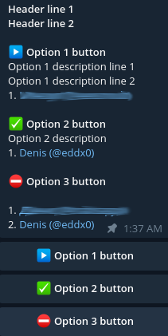

# Simple telegram signup bot

This bot helps to track sign ups for some messages.

To use this bot you should write telegram message in the following format in plain text:

```
Header line 1
Header line 2

▶️ Option 1 button
Option 1 description line 1
Option 1 description line 2

✅ Option 2 button
Option 2 description

⛔️ Option 3 button
```

Then reply to your message with `/create` bot command.

It will delete original message and pin new one with buttons to vote:


